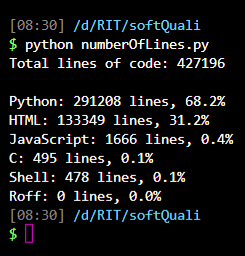
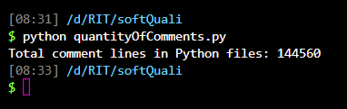
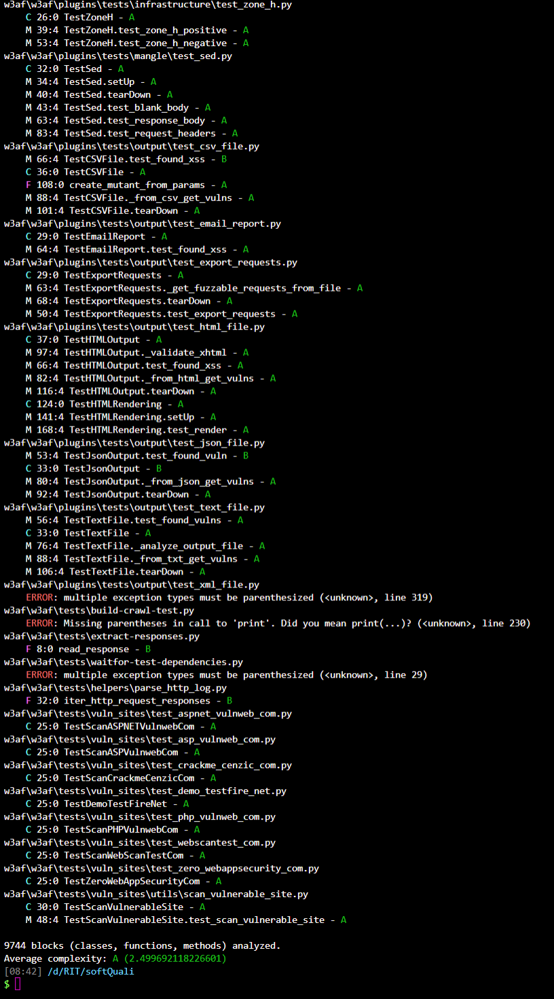

# **Project overview**
W3AF is an open-source framework designed to scan and audit web applications for security vulnerabilities. It helps developers and security testers identify weaknesses like cross-site scripting, SQL injections, and operating system command execution, among over 200 types of vulnerabilities. W3AF uses a combination of plugins that communicate with each other to discover, audit, and exploit vulnerabilities effectively. It supports both graphical and command-line interfaces, making it flexible for different users. By using W3AF, developers can strengthen the security of their web applications during development and testing phases, ensuring more robust and protected software.

# **Key quality metrics**

## Lines of code
One of our group members developed a script to analyze the entire project and calculate the total lines of code as well as different percentages representing the usage of various programming languages in the project. The analysis revealed that Python is the predominant language used, while Shell is the least used. This gives a clear overview of the language distribution within the project.

> To run the script please refer to our README.md inside /courseProjectCode\Metrics

## Comment density
The Python files contained nearly 150,000 lines of comments, which is a significant amount compared to other files in the project. Although other files did have comments as well, their volume was much smaller, showing that the Python code had a notably higher level of documented explanation and annotation.

> To run the script please refer to our README.md inside /courseProjectCode\Metrics

## Cyclomatic complexity
For measuring Cyclomatic Complexity, we used an external Python library called Radon. This tool allowed us to analyze different parts of the W3AF codebase and provided detailed metrics on the complexity of functions, methods, and classes. The results showed a very high rating, indicating that the code is well-structured and efficient according to Radon's assessment. Using Radon helped us gain valuable insights into the internal complexity of the project and supported our evaluation of its design quality.

> To run radon please refer to our README.md inside /courseProjectCode\Metrics

## Test coverage
This project uses Pytest as its testing framework, with a total of 515 tests implemented. Having such a large number of tests is a strong indicator of thorough coverage and reliability. The tests are organized in a modular way, which is excellent because it promotes maintainability and makes it easier to isolate and troubleshoot issues. This structure also facilitates adding new tests and expanding the test suite over time, ensuring that the project remains robust as it grows.

> To run the code coverage tool please refer to our README.md inside /courseProjectCode\Metrics
